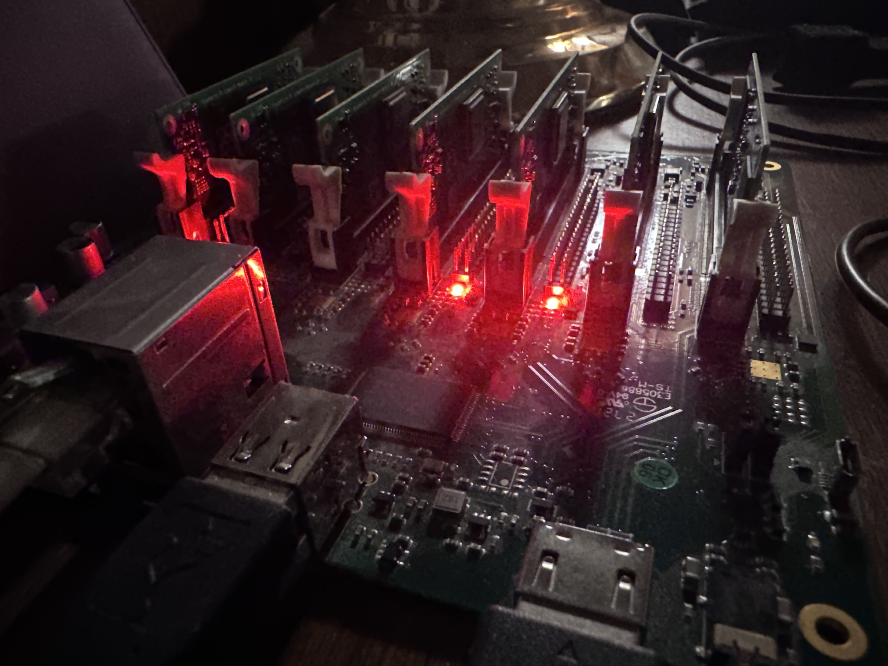

# Turing‑PI v1.1 Automation

## A Fully Automated, Reproducible k3s Cluster Build for CM3+ Nodes

This repository provides a complete, automated build system for running a multi‑node k3s cluster on the Turing‑PI v1.1 using Raspberry Pi Compute Module 3+ boards. While the project includes optional support for distcc‑accelerated builds, the primary goal is much broader: to deliver a repeatable, infrastructure‑as‑code workflow that provisions, configures, validates, and maintains an entire ARM-based cluster from bare metal to a functioning Kubernetes environment.

---

## What This Project Actually Does

A high‑level overview of the cluster automation:

### 1. Base OS Provisioning

- Automated deployment of Arch Linux ARM to each CM3+ node
- Consistent filesystem layout, SSH configuration, and baseline packages
- Deterministic, reproducible node images for rapid rebuilds

### 2. Cluster Bootstrapping

- Automated node discovery and inventory generation
- Role‑based configuration (control-plane, workers, builders, utility nodes)
- Network configuration tailored for the Turing‑PI backplane

### 3. k3s Installation and Configuration

- Automated installation of k3s across all nodes
- Control-plane initialization and token distribution
- Worker node join automation
- Optional CNI customization (Flannel default, but adaptable)

### 4. Validation and Health Checks

- Playbooks to verify kernel configuration
- Playbooks to verify builder nodes
- Sanity checks for cluster readiness and node health

### 5. Optional: distcc Builder Integration

While not the core of the project, the repo includes automation for:

- Setting up distcc builder nodes
- Coordinating distributed compilation across the cluster
- Validating builder availability and toolchain correctness

This is an optional enhancement, not the primary purpose of the repository.

---

## Why This Repository Exists

The Turing‑PI v1.1 is a fantastic piece of hardware, but building a stable, reproducible cluster on CM3+ modules requires a lot of manual steps. This project solves that by providing:

- Infrastructure-as-code for the entire cluster lifecycle
- Repeatable builds for OS images and cluster configuration
- Automated verification to ensure correctness
- A foundation for k3s workloads, CI/CD, distributed builds, or homelab experimentation

---

## Repository Structure (High-Level)

Directory / File — Purpose

- `inventory/` — Node definitions, roles, and group variables
- `roles/` — Modular Ansible roles for OS prep, k3s, distcc, kernel checks, etc.
- `site.yml` — Full cluster provisioning playbook
- `verify_kernel.yml` — Kernel validation workflow
- `verify_builder.yml` — distcc builder validation
- `README.md` — Overview and usage instructions

---

## Getting Started

1. Clone the repository
2. Adjust the inventory for your node layout
3. Run the main playbook to provision the entire cluster
4. Validate with the included verification playbooks
5. Deploy workloads to your new k3s cluster

---

## Future Enhancements

- Optional Cilium or Kube‑Router CNI
- Automated Helm bootstrap (ArgoCD, monitoring, dashboards)
- Improved builder orchestration
- Prebuilt CM3+ images for faster provisioning
